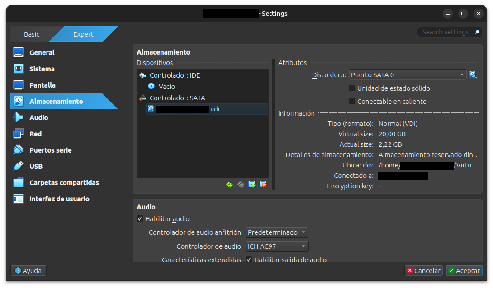
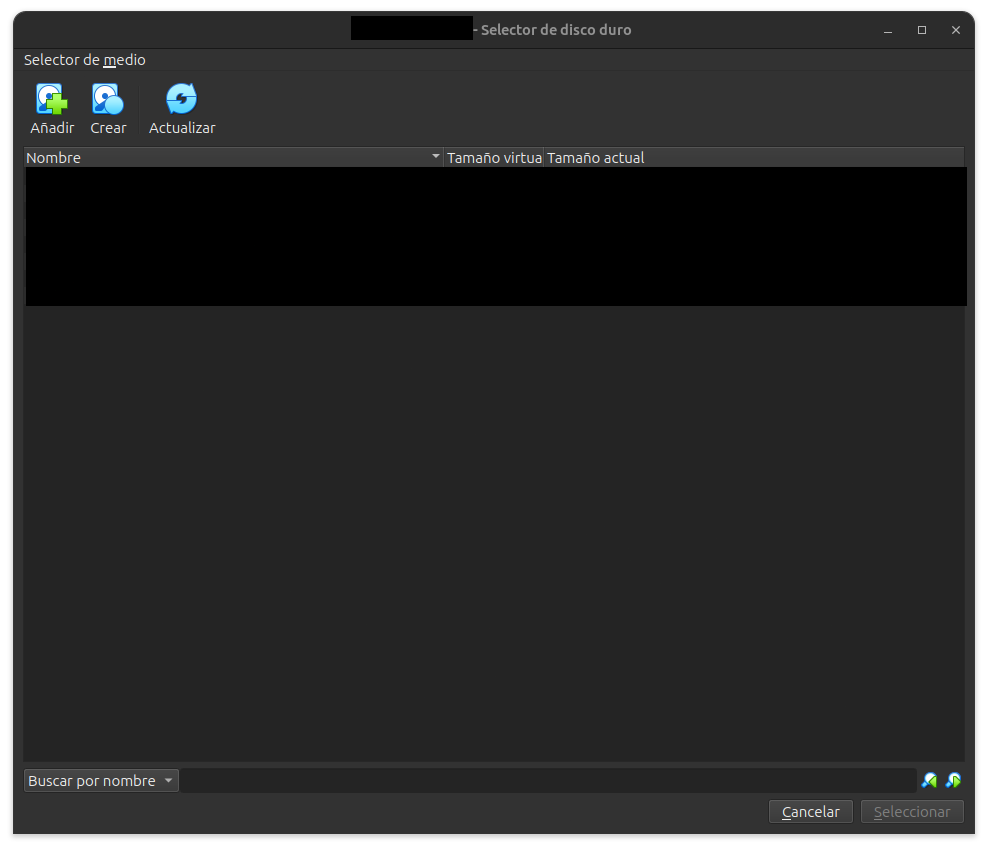
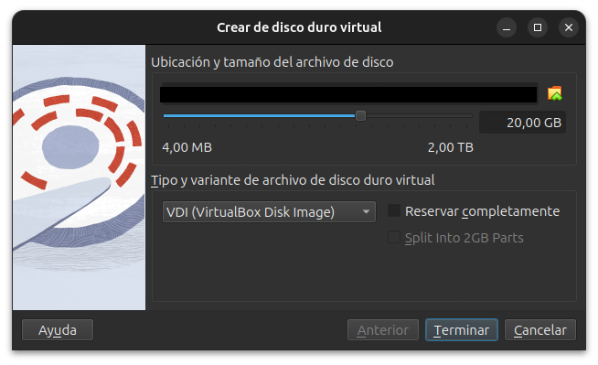
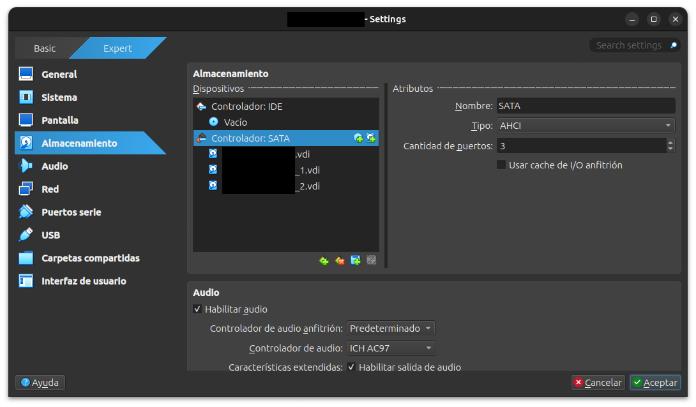

# Definición

Redundant Array of Independent/Inexpensive Disks (RAID) es un tecnología que permite agrupar varios dispositivos de almacenamiento (en nuestro caso, discos duros), creando un nuevo dispositivo virtual con capacidades extendidas 

---
# Tipos de RAID's
Los niveles de RAID relevantes (en este caso) son: 0, 1 y 5.
## RAID 0 (Stripping)
**RAID 0**, también llamado **striping**, es una forma de combinar varios discos duros o SSD para que funcionen como si fueran uno solo. Los datos se dividen en partes y se escriben **simultáneamente en varios discos**, lo que permite que la información se lea y se escriba más rápido. Por ejemplo, si tienes dos discos, cada uno guarda una parte del archivo, por lo que el sistema puede trabajar con ambos al mismo tiempo.

La principal **ventaja** de RAID 0 es el **aumento del rendimiento**. Al repartir los datos entre varios discos, las operaciones de lectura y escritura se vuelven mucho más rápidas. Además, permite **aprovechar toda la capacidad de los discos**, es decir, si tienes dos discos de 1 TB tendrás 2 TB totales disponibles. Por eso se usa a veces en sistemas donde la velocidad es muy importante, como en edición de vídeo, juegos o procesamiento de datos.

Sin embargo, su gran **desventaja** es que **no ofrece ninguna seguridad para los datos**. Si uno de los discos falla, se pierde toda la información del sistema RAID porque cada archivo está dividido entre los discos. Esto hace que RAID 0 sea **el menos seguro de todos los niveles de RAID**, por lo que normalmente solo se recomienda cuando se busca rendimiento y se tienen copias de seguridad en otro lugar.
## RAID 1 (Mirror)
**RAID 1**, también llamado **mirroring**, es un sistema de almacenamiento en el que los datos se **copian exactamente en dos discos al mismo tiempo**. Esto significa que cada archivo que se guarda en un disco también se guarda automáticamente en el otro, creando una copia idéntica. De esta forma, ambos discos contienen la misma información en todo momento.

La principal **ventaja** de RAID 1 es la **seguridad de los datos**. Si uno de los discos falla, el sistema puede seguir funcionando con el otro porque contiene exactamente la misma información. Además, la **lectura puede ser más rápida**, ya que el sistema puede leer datos desde cualquiera de los dos discos.

Sin embargo, su **desventaja principal** es que **solo se aprovecha la mitad de la capacidad total**. Por ejemplo, si tienes dos discos de 1 TB, el sistema solo tendrá 1 TB disponible porque el otro se usa para la copia. También puede ser más costoso, ya que se necesitan más discos para almacenar la misma cantidad de datos.
## RAID 5 (Spare)
**RAID 5** es un sistema de almacenamiento que combina **varios discos (mínimo tres)** para formar una única unidad lógica. Los datos se dividen entre los discos, pero además se guarda **información de paridad**, que sirve para reconstruir los datos si uno de los discos falla. Esta paridad no se guarda en un único disco, sino que **se distribuye entre todos**, lo que mejora el rendimiento y la seguridad.

La principal **ventaja** de RAID 5 es que ofrece un **equilibrio entre capacidad, rendimiento y seguridad**. Permite usar la mayor parte del espacio de los discos y, si **uno de los discos se estropea**, el sistema puede seguir funcionando porque los datos pueden reconstruirse usando la paridad. Además, las **lecturas suelen ser rápidas**, ya que se pueden realizar en varios discos a la vez.

Sin embargo, también tiene **algunas desventajas**. Las **escrituras son más lentas** que en RAID 0 porque el sistema debe calcular y guardar la paridad cada vez que se escriben datos. Además, si **fallan dos discos al mismo tiempo**, se pierde toda la información. Por eso RAID 5 se usa mucho en **servidores y sistemas de almacenamiento**, donde se busca un buen equilibrio entre seguridad y eficiencia del espacio.

---
# Implementación de RAID

A la hora de implementar RAID's en nuestros servidores, existen 2 maneras diferentes de hacerlo. Con **hardware** y con **software**, veamos las diferencias entre las dos tecnologías a continuación.
### Hardware

- Existe un **chipset o controlador RAID dedicado** que se encarga de realizar los cálculos necesarios (por ejemplo, los cálculos de paridad en RAID 5).
- El procesamiento del RAID **no lo hace la CPU del sistema**, sino el propio controlador.
- **Ventaja:** mayor **rendimiento y eficiencia**, ya que el hardware está especializado para esta tarea.
- **Ventaja:** mayor **fiabilidad y estabilidad** en sistemas críticos.
- **Desventaja:** **mayor coste**, ya que requiere controladores RAID específicos.
### Software

- El RAID se implementa mediante un **driver o software del sistema operativo** que gestiona varios discos como si fueran uno solo.
- El sistema operativo **realiza los cálculos de RAID usando la CPU** del equipo.
- **Ventaja:** **no requiere hardware adicional**, por lo que es más barato y fácil de implementar.
- **Desventaja:** **menor rendimiento**, porque consume recursos del sistema (CPU y memoria).
- **Desventaja:** puede ser **menos robusto** que el RAID por hardware en algunos casos.

---
# Uso en VBox

> [!WARNING]
> Una vez modificado los RAIDs no se va a poder clonar la máquina donde se hayan configurado.
## Comandos útiles
Es importante conocer una serie de comandos que listaremos a continuación:
### lsblk
1. En primer lugar tenemos el comando `lsblk`.

Mediante este comando podremos ver los diferentes discos así como sus respectivas particiones.

En la máquina utilizada para este proyecto se observa inicialmente un único disco (`sda`) con una capacidad de 20 GB. Este disco se divide en dos particiones:
- **sda1**: partición de arranque (`/boot`), donde se almacenan los archivos necesarios para iniciar el sistema operativo. Mantener esta partición separada evita que problemas de espacio en el sistema principal impidan el arranque.
- **sda2**: partición principal del sistema, que utiliza **LVM (Logical Volume Manager)** para gestionar el almacenamiento.    

Dentro de esta partición encontramos dos volúmenes lógicos:
- **rlm_vbox-root**: volumen lógico montado en `/`, que contiene el sistema de archivos principal.
- **rlm_vbox-swap**: volumen lógico destinado a **swap**, utilizado como memoria virtual cuando la memoria RAM se agota.

```bash
[hachmiss ~]$lsblk
NAME              MAJ:MIN RM  SIZE RO TYPE MOUNTPOINTS
sda                 8:0    0   20G  0 disk 
├─sda1              8:1    0    1G  0 part /boot
└─sda2              8:2    0   19G  0 part 
  ├─rlm_vbox-root 253:0    0   17G  0 lvm  /
  └─rlm_vbox-swap 253:1    0    2G  0 lvm  [SWAP]
sr0                11:0    1 1024M  0 rom  
```

### df -h
2. Otro comando muy útil es `df -h`.

El comando `df -h` permite visualizar el uso del espacio en disco de los sistemas de archivos montados en el sistema. Proporciona información sobre el tamaño total de cada sistema de archivos, el espacio utilizado, el espacio disponible y el punto de montaje donde se encuentra accesible en el sistema.
```bash
[hachmiss ~]$df -h
S.ficheros                Tamaño Usados  Disp Uso% Montado en
devtmpfs                    4,0M      0  4,0M   0% /dev
tmpfs                       854M      0  854M   0% /dev/shm
tmpfs                       342M   4,8M  337M   2% /run
/dev/mapper/rlm_vbox-root    17G   1,9G   16G  11% /
/dev/sda1                   960M   255M  706M  27% /boot
tmpfs                       171M      0  171M   0% /run/user/1000
```

Dentro de los diferentes sistemas montados podemos apreciar unos en concreto que  se reconocen por la abreviación `tmps` **(temporal file system)** el cual solo son sistemas temporales que se reinician en cada arranque.

De todos los directorios que observamos el que más nos preocupa en cuanto a **persistencia** para el RAID es el directorio raíz (`/dev/mapper/rlm_vbox-root`) que puede llegar a crecer demasiado.
## Sistema de archivos Linux
Veamos por encima los **principales archivos del sistema Rocky** que usamos en este proyecto:

```bash  
[hachmiss ~]$ ls /  
afs  boot  etc   lib    media  opt   root  sbin  sys  usr  
bin  dev   home  lib64  mnt    proc  run   srv   tmp  var
```
En el sistema Linux podemos encontrar diferentes directorios con funciones específicas.
- **/dev**  
    Contiene los dispositivos del sistema. En Linux los periféricos se representan como **ficheros**, lo que simplifica mucho la interacción con ellos y facilita el desarrollo de herramientas y APIs por parte de los programadores.
- **/boot**  
    Directorio donde se almacenan los **archivos necesarios para el arranque del sistema**.  
    Como se mencionó anteriormente, en esta máquina se encuentra en **una partición separada**, lo que ayuda a evitar problemas de arranque si el sistema principal se queda sin espacio.
- **/home**  
    Directorio donde se almacenan los **datos de los usuarios del sistema**.  
    En entornos de servidores es habitual aplicar **cuotas de disco** para evitar que un usuario consuma todos los recursos disponibles.
- **/var**  
    Directorio donde se almacenan **datos variables del sistema**, como logs, colas de procesos o cachés.  
    Debido a que aquí se guarda información crítica y puede crecer rápidamente, en muchos servidores se suele ubicar en **una partición independiente** o incluso sobre **sistemas RAID** para mejorar la seguridad y disponibilidad de los datos.
En general, estos directorios tienen en común que **pueden crecer considerablemente en tamaño**, por lo que es habitual gestionarlos mediante **particiones separadas o sistemas de almacenamiento más avanzados**, como veremos en las siguientes secciones. 

> [!TIP] 
> Si se desea saber más sobre el sistema de almacenamiento de linux así como los estándares se recomienda el siguiente recurso https://www.redhat.com/en/blog/etc-fstab.
## Aumento del número de discos

Ahora que sabemos los detalles más relevantes en cuando a manejo de sistemas de archivos, nos interesará **implementar nuevos discos SATA** para los respectivos RAID que vayamos a hacer a nuestro servidor virtual. Veamos como podemos llevar a cabo dicha configuración empezando desde VirtualBox.

Realizaremos un mirroring al directorio `/var` por las diferentes razones de seguridad y almacenamiento comentadas con anterioridad (de igual manera se podría hacer un RAID 5), veamos como hacerlo. 

Lo primero será **añadir un nuevo disco** esto es crucial, y lo haremos con la máquina apagada.

> [!WARNING]
> No se puede realizar un RAID en un disco que contenga información, ya que para el montaje del mismo será necesario borrar todo el disco.

Dentro de la configuración de la máquina tendremos que darle a **crear nuevo disco** que es el icono de un disco magnético en la zona de *controlador: SATA* (`máquina -> configuración -> almacenamiento -> añadir disco duro -> crear`).  Añadiremos 2 discos poniendo en este caso todo por defecto.
<p align="center">
  
</p>
<p align="center">
  
</p>
<p align="center">
  
</p>
<p align="center">
  
</p>
Y entonces ya tenemos los 2 discos cada uno de 20 GB.
# Creación y monitorización de los RAID

Usando el **gestor de RAID para monitorizar** `mdadm`, y en modo superusuario ejecutaremos los siguientes comandos (no esta instalado por defecto en Rocky, lo mejor es instalarlo usando el gestor de paquetes por defecto de Rocky:`sudo dnf install mdadm`).

> [!TIP]
> En caso de no tener algún comando instalado siempre se puede usar el comando `dnf provides comando`, y este nos dirá si esta disponible, y como instalarlo

```bash
sudo mdadm --create /dev/md0 --level=1 --raid-devices=2 /dev/sdb /dev/sdc
```

En este comando indicamos:
- **`--create`** → crea un nuevo dispositivo RAID
- **`/dev/md0`** → nombre del dispositivo RAID que se creará
- **`--level=1`** → tipo de RAID que se utilizará (RAID 1, mirroring)
- **`--raid-devices=2`** → número de discos que formarán el RAID
- **`/dev/sdb /dev/sdc`** → discos físicos que se utilizarán para crear el RAID

Ahora mediante el siguiente comando podemos visualizar el contenido del fichero `/proc/mdstat`, que contiene información sobre el estado de los dispositivos RAID gestionados por el sistema.
```bash  
more /proc/mdstat
```

Si queremos observar cómo avanza la creación o sincronización del RAID, podemos utilizar el comando `watch`:
```bash
watch more /proc/mdstat
```
Este comando ejecutará la consulta cada pocos segundos, permitiendo ver **en tiempo real el progreso del RAID**, se verá una barra de progresión a  medida de que se va implementando el RAID en disco. Además, también nos aparece una serie de datos muy útiles como:
- **Discos** en los que se están montando el RAID.
- **Tipo de RAID** que se esta montando.
- Bloques completados, porcentajes, velocidad, entre muchos más datos.
A continuación se muestra un ejemplo
```bash
Every 2.0s: more /proc/mdstat                              ****: *** *** ** **:**:**

Personalities : [raid1]
md0 : active raid1 sdc[1] sdb[0]
      20954112 blocks super 1.2 [2/2] [UU]
      [==>..................]  resync = 14.3% (3001984/20954112) finish=1.4min speed=200132K/sec

      bitmap: 1/1 pages [4KB], 65536K chunk

unused devices: <none>
```

Una vez que la barra de progreso termine veremos algo similar a lo siguiente:
```bash
Personalities : [raid1]
md0 : active raid1 sdc[1] sdb[0]
      20954112 blocks super 1.2 [2/2] [UU]

unused devices: <none>
```
De esta forma se creará un dispositivo RAID llamado **`/dev/md0`**, que mantendrá una copia idéntica de los datos entre ambos discos.
El nombre se asigna siguiendo ciertos estándares.

Ya tendremos un RAID montado. Pasaremos a continuación a montar un sistema [LVM](LVM.md) por encima para poder manejar de forma flexible la memoria de los RAIDs.

De esta forma combinamos ambas tecnologías para construir un sistema de almacenamiento **más robusto y adaptable**.

---
Después de haber montado los RAID's el siguiente punto según el flujo de trabajo sería [LVM](LVM.md).