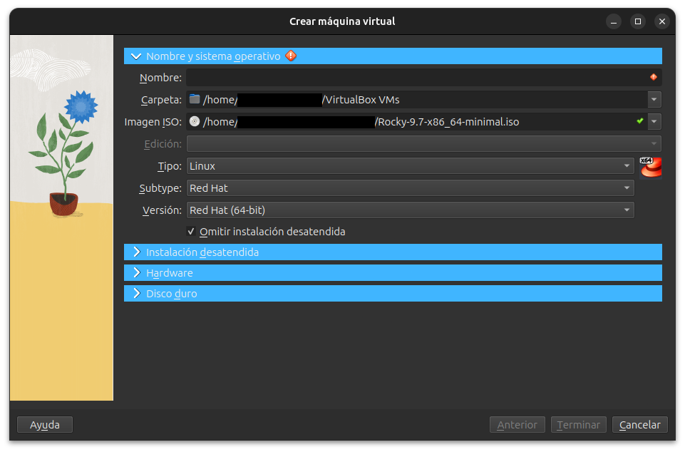
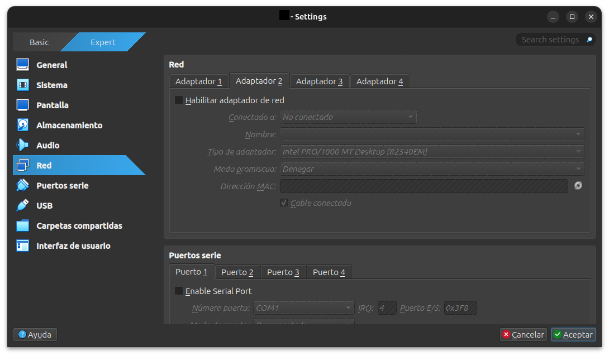
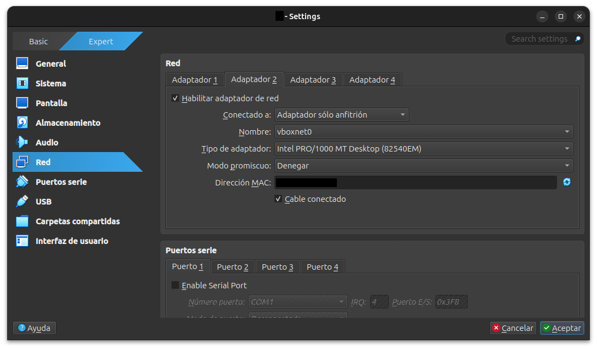

# Creación de la VM

En esta sección veremos como levantar el sistema operativo Rocky en una máquina virtual. En esta sección se podrán ver capturas de pantalla de VirtualBox por lo que puede que no coincidan con el sistema de virtualización del usuario.
## Primeros pasos
Después de instalar nuestro sistema operativo (véase [README](../README.md)) lo siguiente que haremos será levantar la imagen en VirtualBox, esto es sencillo. 
### Levantar la imagen
Dentro de VibtualBox observaremos una opción que es **crear**, la pulsamos y se nos despliega el siguiente menú:
<p align="center">
  
</p>
Como se puede apreciar en la imagen ya se a seleccionado la imagen, los demás campos se rellenan de manera automática.

Ahora le asignamos nombre a la máquina y seguidamente activaremos la opción de ***Omitir instalación desatendida*** así evitaremos problemas para con la instalación automática que realiza VirtualBox. Una vez que hagamos esto ya podremos continuar presionando el botón de terminar. Y ya tendremos la imagen levantada en una máquina de VirtualBox.

Una vez levantado solamente hace falta seguir las indicaciones de la interfaz de instalación de Rocky. 

> [!TIP] 
> Se recomienda que no se cree un usuario root, y que solo se cree un usuario con privilegios de administrador. Esto se hace por cuestiones de seguridad.

---
# Configuración de las interfaces de red
Ahora con el objetivo de poder **conectarnos al servidor desde la terminal de nuestra máquina** usando **SSH**, lo cual hará que trabajar con el servidor sea más cómodo, configuraremos las **interfaces de red** desde VirtualBox, veamos como:

### Configuración en VirtualBox
Será necesario añadir **un segundo adaptador de red**.

Para ello nos dirigimos a la máquina en VirtualBox y vamos a `configuración -> red -> Adaptador 2` y activamos la opción de ***Habilitar adaptador de red (Host-only Adapter)***.

En en la pestaña ***Conectado a:*** elegimos la opción ***Adaptador solo anfitrión***. 
A continuación se muestra una serie de capturas que pueden servir de guía: 
<p align="center">
  
</p>
<p align="center">
  
</p>

Y con todo esto ya estaríamos listos para arrancar nuestra máquina y conectarnos a el por **SSH**

En Rocky Linux el servicio **SSHD** suele venir instalado por defecto en la versión minimal utilizada en este proyecto, por lo que normalmente no será necesario configurarlo manualmente en este punto, de todas formas esto se abordará en un futuro en el proyecto, así que si se tiene algún problema pueden ir a la sección de [Firewall & SSHD](FIREWALL_&_SSHD.md).

Para evitar que se modifique la ip de la máquina es conveniente realizar los siguientes pasos, aunque esto no es estrictamente necesario para el funcionamiento del sistema, es necesario si queremos hacer automatizaciones y para tener identificado al servidor:

Podemos ver las conexiones disponibles en este momento. Para facilitar su identificación, se modifica el nombre de la conexión utilizando el siguiente comando:  

```bash
nmcli c modify "Nombre-antiguo" connection.id "Nombre-nuevo"
```

Una vez renombrada la conexión, se procede a listar todas las conexiones configuradas en el sistema:  

```bash
nmcli c show
```
  
A continuación, se configura una dirección IP estática, deshabilitando el uso de DHCP. Para ello se modifican los parámetros `method` y `addresses`:  

> [!NOTE]
> Puede que no se conozca el protocolo DHCP pero no hay problema con ello, es suficiente con saber que es el protocolo responsable de la asignación dinámica de direcciones IP.

```bash
nmcli connection modify <NOMBRE> ipv4.method manual  
nmcli connection modify <NOMBRE> ipv4.addresses 192.168.X.X/24
```

donde `<NOMBRE>` corresponde al identificador de la conexión.
Finalmente, se verifica que los cambios se han aplicado correctamente accediendo al modo de edición de la conexión y mostrando su configuración:  

```bash
[hachmiss ~]$ nmcli c edit <NOMBRE>

===| Editor de conexión interactivo de nmcli |===

Modificando la conexión «****» existente: «****»

Escriba «help» o «?» para comandos disponibles.
Escriba «print» para mostrar todas las propiedades de conexión.
Escriba «describe [<parámetro>.<prop>]» para una descripción de propiedad detallada.

Puede modificar los siguientes parámetros:****
nmcli> print
....
```

Y solo nos interesará comprobar que los cambios se han realizado de manera correcta:

```bash
ipv4.method:                            manual
ipv4.dns:                               --
ipv4.dns-search:                        --
ipv4.dns-options:                       --
ipv4.dns-priority:                      0
ipv4.addresses:                         192.168.X.X/24
```

> [!TIP]
> También se puede usar el modo con interfaz que puede ser más amigable mediante el comando `nmtui`

### Conectarse mediante SSH
De manera rápida podemos conectarnos ,teniendo nuestra **máquina encendida**, usando **SSH**, veamos de manera simple como conectarnos.

Nos dirigiremos a la máquina virtual y desde allí ejecutaremos el comando `ip a` de esta manera podremos ver las diferentes interfaces de red de la máquina obteniendo una salida de este estilo:

```bash
[hachmiss ~]$ ip a

1: lo: <LOOPBACK,UP,LOWER_UP> mtu 65536 qdisc noqueue state UNKNOWN group default qlen 1000
    link/loopback **:**:**:**:**:** brd **:**:**:**:**:**
    inet 127.0.0.1/8 scope host lo
       valid_lft forever preferred_lft forever
    inet6 ::1/128 scope host
       valid_lft forever preferred_lft forever

2: emp0s3: <BROADCAST,MULTICAST,UP,LOWER_UP> mtu 1500 qdisc fq_codel state UP group default qlen 1000
    link/ether **:**:**:**:**:** brd ff:ff:ff:ff:ff:ff
    inet **.**.**.**/24 brd **.**.**.255 scope global dynamic noprefixroute emp0s3
       valid_lft *****sec preferred_lft *****sec
    inet6 ****:****:****:****::****/64 scope global dynamic noprefixroute
       valid_lft *****sec preferred_lft *****sec
    inet6 ****::****:****:****:****/64 scope link noprefixroute
       valid_lft forever preferred_lft forever

3: emp0s8: <BROADCAST,MULTICAST,UP,LOWER_UP> mtu 1500 qdisc fq_codel state UP group default qlen 1000
    link/ether **:**:**:**:**:** brd ff:ff:ff:ff:ff:ff
    inet ***.***.**.***/24 brd ***.***.**.255 scope global dynamic noprefixroute emp0s8        <--------------- Esta dirección nos interesa
       valid_lft *****sec preferred_lft *****sec
    inet6 ****:****:****:****::****/64 scope global dynamic noprefixroute
       valid_lft *****sec preferred_lft *****sec
    inet6 ****::****:****:****:****/64 scope link noprefixroute
       valid_lft forever preferred_lft forever
```
No hace falta saturarse con toda la información mostrada por pantalla, **lo único que nos interesará** será la interfaz`emp0s8` en la cual **nos fijaremos en la dirección IPv4** y esa será la dirección por la que nos conectaremos. Esta interfaz **suele mantener una dirección IP estable** dentro de la red host-only. Ubicaremos la dirección ip viendo un número formado por 4 números (octetos de bits) ubicado al lado de `inet`.

Una vez ubicada la dirección ip, simplemente nos conectaremos desde nuestra máquina usando el siguiente comando:
```bash
ssh usuario@direccion_ip
```
Y ya estaremos en al máquina virtual desde nuestra propia máquina.

---
Una vez finalizada toda esta configuración se recomienda avanzar con la sección [RAID](RAID.md).
